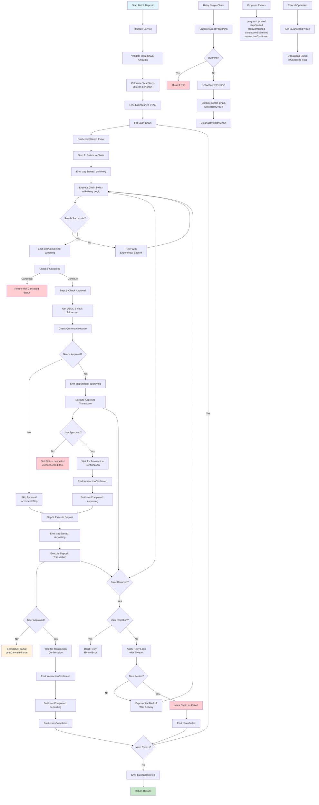

# Argenta Multi-Chain Vault (Sepolia + Sei Testnet)

Live APP URL: https://argenta-finance.vercel.app/

Focus: multi-chain UX, a resilient batch **Approve → Deposit** flow, and clear transaction feedback.

> ✨ Key design choice: a **framework-agnostic task runner** (pure TypeScript service) orchestrates multi-chain deposits. React is just a thin UI wrapper around it.

---

https://github.com/user-attachments/assets/d8dce002-c8fe-4012-9dab-aabbf632d125
DEMO (Prior, I accidentally approved a massive allowance on Sepolia net, thus the approval skip)

## Approach & Architecture

This project was built with a focus on **modularity**, **multi-chain support**, and **clear UX for batch transactions**.

- **Framework**: Next.js (App Router) for routing, performance, and deployment simplicity
- **Web3 Layer**: wagmi + viem for typed, reactive blockchain interactions
- **Wallet Connection**: RainbowKit for multi-wallet support
- **State Management**: Zustand for lightweight, predictable global state
- **UI**: Tailwind CSS with responsive, mobile-first layout
- **Multi-Chain Support**: Chain configs stored centrally with addresses & RPC URLs
- **Batch Operations**: Step-based flow to approve and deposit USDC across multiple chains in one sequence

**Trade-offs:**

- Transaction state (in-progress or completed) is not persisted; it is lost on a hard refresh. If given more time, I would implement state persistence in Zustand so that users can resume transactions after a page reload.

---

## Requirements

- Node.js 20+
- pnpm (recommended) or npm
- Wallet with testnet USDC (Sepolia and Sei). Currently, I have only tested on MetaMask due to constraint

---

## Quick Start

```bash
cd web
cp .env.example .env.local   # fill in RPC URLs if you have your own
pnpm i                       # or npm i / yarn
pnpm generate                # ⬅️ required: generates wagmi/viem clients & ABIs
pnpm dev                     # open http://localhost:3000
```

## To get USDC token to SEI Testnet

You can use the `bluewater-usdc-cctp` utility provided in this repository.

```bash
cd bluewater-usdc-cctp
cp .env.example .env       # Fill in required private key and RPC URLs
pnpm install               # or npm install / yarn
pnpm start                 # Runs transfer.js to bridge USDC to Sei Testnet
```

## Why We Use `createBatchDepositService` instead of WAGMI hook

PS: THIS IS BEFORE I KNEW WagmiCore exist.

Our batch deposit service was designed to handle **multi-chain deposits** with high reliability, especially in a DeFi context where network conditions and RPC reliability vary widely. Instead of relying on simple sequential calls, we built a **resilient, event-driven execution model**.

### Key Advantages

1. **Multi-Chain Support Without Stale Clients**  
   We create **per-chain `PublicClient` instances** via `viem` instead of reusing a single one.  
   This avoids “stale provider” issues after chain switches, ensuring each chain’s transactions are always sent to the correct RPC.

2. **Retry + Timeout for Unreliable RPCs**

   - All core blockchain interactions (`allowance`, `approve`, `deposit`, `waitForTransactionReceipt`) are wrapped with:
     - `withTimeout` — prevents a call from hanging forever.
     - `withRetry` — uses exponential backoff for transient RPC failures.
   - **Benefit:** Users aren’t forced to restart the whole batch because of one slow RPC.

3. **User-Friendly Cancellation**  
   Users can cancel at any stage, stopping further operations instantly (`isCancelled` flag).  
   This is crucial for avoiding accidental multi-chain deposits if they change their mind mid-process.

4. **User Rejection Handling**

   - If a user rejects a transaction, we **stop retrying** immediately (`withUserTransaction`).
   - Prevents spammy repeated wallet prompts for the same action.

5. **Progress Tracking & UI Integration**

   - Emits typed events (`progressUpdated`, `stepStarted`, `stepCompleted`, etc.) so the UI can update in real-time.
   - Allows showing per-chain and overall batch progress without hardcoding UI logic into the service.

6. **Granular Retry per Chain**

   - Failed chains can be retried individually with `retryChain` without restarting the whole batch.
   - Optimizes UX for partial successes.

7. **Portable**
   - Well it just ts file not react specific

### Why Not Just Call Wagmi Directly in Components?

We could directly call `wagmi` hooks in components for each chain, but:

- It would spread retry, timeout, and error-handling logic across multiple UI files.
- It would make progress tracking harder since UI state and business logic would be mixed.
- It would be harder to reuse this logic in other contexts (e.g., CLI tool, backend service, automation script).

By **centralizing all batch execution logic** into `createBatchDepositService`, we get:

- A single source of truth for batch deposit rules.
- Cleaner UI code that only listens for events and updates the interface.
- Easier unit testing of the batch logic without spinning up the full frontend.

---

**In short:**  
`createBatchDepositService` gives us a **modular, resilient, and testable foundation** for multi-chain deposit flows — one that handles chain switching, approvals, deposits, retries, timeouts, progress tracking, and user cancellations in a single cohesive service.

---

## Notes & Challenges

- One of the biggest time sinks — and not particularly productive — was figuring out how to get USDC to the Sei Testnet. The official Circle CCTP reference at [https://replit.com/@buildoncircle/cctp-v2-web-app](https://replit.com/@buildoncircle/cctp-v2-web-app) did not work for me despite multiple attempts. While eventually resolved via a script (`bluewater-usdc-cctp`), this consumed a disproportionate amount of the available build time.

## Sequence Diagram


