# Individual Chain Operations Flow

This document describes the complete flow for individual chain approval and deposit operations implemented in the ChainApprovalCard component.

## Main Flow Chart

```mermaid
graph TD
    A[User Enters Amount] --> B{Needs Approval?}

    B -->|Yes| C["● PENDING<br/>🟡 Yellow Pulse<br/>[APPROVE ALLOWANCE]"]
    B -->|No| D["● READY TO DEPOSIT<br/>🟢 Green Static<br/>[DEPOSIT]"]

    C --> E[User Clicks Approve]
    E --> F["● APPROVING<br/>🟠 Orange Pulse<br/>[APPROVING...]"]

    F --> G[Transaction Submitted]
    G --> H["● TRANSACTING<br/>🟠 Orange Pulse<br/>[CONFIRMING...]"]

    H --> I{Success?}
    I -->|Yes| J[Transaction Confirmed]
    I -->|No| K["● FAILED/CANCELLED<br/>🔴 Red Static<br/>[🔄 RETRY]"]

    J --> L["● DEPOSITING<br/>🟠 Orange Pulse<br/>[DEPOSITING...]<br/>📜 Approval Hash Shown"]

    L --> M[Transaction Submitted]
    M --> N["● TRANSACTING<br/>🟠 Orange Pulse<br/>[CONFIRMING...]"]

    D --> O[User Clicks Deposit]
    O --> L

    N --> P{Success?}
    P -->|Yes| Q[Transaction Confirmed]
    P -->|No| R["● FAILED/CANCELLED<br/>🔴 Red Static<br/>[🔄 RETRY]"]

    Q --> S["● COMPLETED<br/>🟢 Teal Static<br/>No Button<br/>📜 Both Hashes Shown<br/>🔥 Gas Section Hidden"]

    K --> T[User Clicks Retry]
    R --> U[User Clicks Retry]
    T --> F
    U --> L

    style A fill:#1a1a1a,stroke:#14b8a6,color:#ffffff
    style C fill:#1a1a1a,stroke:#eab308,color:#ffffff
    style D fill:#1a1a1a,stroke:#22c55e,color:#ffffff
    style F fill:#1a1a1a,stroke:#f97316,color:#ffffff
    style H fill:#1a1a1a,stroke:#f97316,color:#ffffff
    style L fill:#1a1a1a,stroke:#f97316,color:#ffffff
    style N fill:#1a1a1a,stroke:#f97316,color:#ffffff
    style S fill:#1a1a1a,stroke:#14b8a6,color:#ffffff
    style K fill:#1a1a1a,stroke:#ef4444,color:#ffffff
    style R fill:#1a1a1a,stroke:#ef4444,color:#ffffff
```

## Key Features

### Status Indicators

- **● PENDING** - Yellow pulsing dot when approval is needed
- **● APPROVING** - Orange pulsing dot during approval transaction
- **● TRANSACTING** - Orange pulsing dot during confirmation
- **● DEPOSITING** - Orange pulsing dot during deposit transaction (auto-triggered after approval)
- **● READY TO DEPOSIT** - Green static dot when ready for standalone deposit
- **● FAILED/CANCELLED** - Red static dot when transaction fails or user cancels
- **● COMPLETED** - Teal static dot when fully complete

### Button States

- **[APPROVE ALLOWANCE]** - Initial approval action (auto-proceeds to deposit)
- **[DEPOSIT]** - Standalone deposit action (for pre-approved chains)
- **[🔄 RETRY]** - Retry failed operation
- **[APPROVING...]** - During approval submission
- **[DEPOSITING...]** - During deposit submission
- **[CONFIRMING...]** - During transaction confirmation
- **No Button** - When operations are complete

### Auto-Progression Flow

- **Approval → Deposit**: After successful approval, automatically proceeds to deposit
- **Error Recovery**: Failed operations can be retried with the same parameters
- **User Cancellation**: Distinguishes between user cancellation and system errors

### Transaction History

- Approval hash appears after approval confirmation
- Deposit hash appears after deposit confirmation
- Both hashes link to block explorers
- Transaction history section styled like gas estimation

### UI Behavior

- Gas estimation section hidden when operations complete
- Button disappears when all operations finished
- Transaction history persists throughout process
- Status colors and animations provide clear feedback
