# Individual Chain Operations Sequence

This document shows the detailed interaction sequence between components during individual chain operations.

## Sequence Diagram

```mermaid
sequenceDiagram
    participant U as User
    participant UI as ChainApprovalCard
    participant H as useIndividualChainOperations
    participant W as Wagmi/Blockchain
    participant E as Explorer

    Note over U,E: Initial State: ● PENDING

    U->>UI: Clicks "APPROVE ALLOWANCE"
    UI->>H: approveChain(chainId, amount)

    Note over UI: ● APPROVING (Orange Pulse)
    Note over UI: [APPROVING...] Button

    H->>W: writeContract(approve)
    W-->>H: Transaction Hash
    H->>H: Store approval hash
    H->>H: Set confirming state

    Note over UI: ● TRANSACTING (Orange Pulse)
    Note over UI: [CONFIRMING...] Button

    W-->>H: Transaction Confirmed
    H->>H: Reset operation state

    Note over UI: ● READY TO DEPOSIT (Green Static)
    Note over UI: [DEPOSIT] Button
    Note over UI: 📜 Approval Hash + Link to Explorer

    U->>UI: Clicks "DEPOSIT"
    UI->>H: depositChain(chainId, amount)

    Note over UI: ● DEPOSITING (Orange Pulse)
    Note over UI: [DEPOSITING...] Button

    H->>W: writeContract(deposit)
    W-->>H: Transaction Hash
    H->>H: Store deposit hash
    H->>H: Set confirming state

    Note over UI: ● TRANSACTING (Orange Pulse)
    Note over UI: [CONFIRMING...] Button

    W-->>H: Transaction Confirmed
    H->>H: Reset operation state

    Note over UI: ● COMPLETED (Teal Static)
    Note over UI: No Button Shown
    Note over UI: 📜 Both Hashes + Links
    Note over UI: 🔥 Gas Section Hidden
```

## Component Interactions

### useIndividualChainOperations Hook

**Key Functions:**

- `approveChain(chainId, amount)` - Handles approval transaction
- `depositChain(chainId, amount)` - Handles deposit transaction
- `storeTransactionHash(chainId, type, hash)` - Stores transaction hashes
- `getChainTransactions(chainId)` - Retrieves stored transaction data

**State Management:**

- `isOperating` - Boolean indicating if operation is active
- `operatingChain` - Which chain is currently being operated on
- `operationType` - "approval", "deposit", or "confirming"
- `chainTransactions` - Record of transaction hashes per chain

### ChainApprovalCard Component

**Props:**

- `estimate` - Gas estimation data
- `isManualMode` - Whether manual mode is enabled
- `onApprove` - Callback for approval action
- `onDeposit` - Callback for deposit action
- `individualOperationState` - Current operation state
- `getChainTransactions` - Function to get transaction data

**State Logic:**

- `isApproving` - Currently submitting approval
- `isDepositing` - Currently submitting deposit
- `isConfirming` - Currently waiting for confirmation
- `actuallyCompleted` - All operations finished and confirmed

### Transaction Flow

1. **Chain Switch** - Automatically switch to target chain
2. **Transaction Submission** - Submit to blockchain via wagmi
3. **Hash Storage** - Store transaction hash immediately
4. **State Update** - Update to "confirming" state
5. **Confirmation Wait** - Wait for block confirmation
6. **State Reset** - Reset operation state when complete

### Error Handling

- User rejection detection
- Network error handling
- Transaction failure recovery
- Automatic retry capabilities
- Clear error messaging
