# Individual Chain Operations State Machine

This document describes all possible states and transitions in the individual chain operations system.

## State Machine Diagram

```mermaid
stateDiagram-v2
    [*] --> Checking

    Checking --> Pending: No Allowance
    Checking --> ReadyToDeposit: Has Allowance
    Checking --> Error: Check Failed

    Pending --> Approving: Click Approve
    Approving --> TransactingApproval: TX Submitted
    TransactingApproval --> ReadyToDeposit: Approval Confirmed
    TransactingApproval --> Error: TX Failed

    ReadyToDeposit --> Depositing: Click Deposit
    Depositing --> TransactingDeposit: TX Submitted
    TransactingDeposit --> Completed: Deposit Confirmed
    TransactingDeposit --> Error: TX Failed

    Error --> Pending: Retry

    note right of Checking
        ● CHECKING
        🔵 Blue Pulse
        Loading...
    end note

    note right of Pending
        ● PENDING
        🟡 Yellow Pulse
        [APPROVE ALLOWANCE]
    end note

    note right of Approving
        ● APPROVING
        🟠 Orange Pulse
        [APPROVING...]
    end note

    note right of TransactingApproval
        ● TRANSACTING
        🟠 Orange Pulse
        [CONFIRMING...]
    end note

    note right of ReadyToDeposit
        ● READY TO DEPOSIT
        🟢 Green Static
        [DEPOSIT]
        📜 Approval Hash
    end note

    note right of Depositing
        ● DEPOSITING
        🟠 Orange Pulse
        [DEPOSITING...]
    end note

    note right of TransactingDeposit
        ● TRANSACTING
        🟠 Orange Pulse
        [CONFIRMING...]
    end note

    note right of Completed
        ● COMPLETED
        🟢 Teal Static
        No Button
        📜 Both Hashes
        🔥 Gas Hidden
    end note

    note right of Error
        ● ERROR
        🔴 Red Static
        Error Message
    end note
```

## State Definitions

### Initial States

#### Checking

- **Status**: `● CHECKING`
- **Visual**: Blue pulsing dot
- **Button**: Loading indicator
- **Description**: Loading allowance information from blockchain

#### Pending

- **Status**: `● PENDING`
- **Visual**: Yellow pulsing dot
- **Button**: `[APPROVE ALLOWANCE]`
- **Description**: User needs to approve token allowance

#### Ready to Deposit (Pre-approved)

- **Status**: `● READY TO DEPOSIT`
- **Visual**: Green static dot
- **Button**: `[DEPOSIT]`
- **Description**: Already has allowance, ready for deposit

### Transaction States

#### Approving

- **Status**: `● APPROVING`
- **Visual**: Orange pulsing dot
- **Button**: `[APPROVING...]` (disabled)
- **Description**: Approval transaction being submitted

#### Transacting (Approval)

- **Status**: `● TRANSACTING`
- **Visual**: Orange pulsing dot
- **Button**: `[CONFIRMING...]` (disabled)
- **Description**: Approval transaction waiting for confirmation

#### Ready to Deposit (Post-approval)

- **Status**: `● READY TO DEPOSIT`
- **Visual**: Green static dot
- **Button**: `[DEPOSIT]`
- **UI Elements**: Transaction history shows approval hash
- **Description**: Approval confirmed, ready for deposit

#### Depositing

- **Status**: `● DEPOSITING`
- **Visual**: Orange pulsing dot
- **Button**: `[DEPOSITING...]` (disabled)
- **Description**: Deposit transaction being submitted

#### Transacting (Deposit)

- **Status**: `● TRANSACTING`
- **Visual**: Orange pulsing dot
- **Button**: `[CONFIRMING...]` (disabled)
- **Description**: Deposit transaction waiting for confirmation

### Final States

#### Completed

- **Status**: `● COMPLETED`
- **Visual**: Teal static dot
- **Button**: None (hidden)
- **UI Elements**:
  - Transaction history shows both approval and deposit hashes
  - Gas estimation section hidden
- **Description**: All operations successfully completed

#### Error

- **Status**: `● ERROR`
- **Visual**: Red static dot
- **Button**: Error message or retry option
- **Description**: Operation failed, user can retry

## State Transitions

### Triggers

- **User Actions**: Button clicks (approve, deposit, retry)
- **Blockchain Events**: Transaction submission, confirmation, failure
- **System Events**: Allowance checks, component mounting

### Validation Rules

- Cannot transition to depositing without approval (unless pre-approved)
- Cannot show completed until both operations confirmed
- Error states can transition back to pending for retry
- Confirming states cannot be interrupted by user actions

### UI Consistency Rules

- Pulsing dots indicate active/waiting states
- Static dots indicate stable states
- Orange color for processing states
- Green/Teal for successful states
- Button text matches current operation state
- Transaction history persists across all states after first transaction
