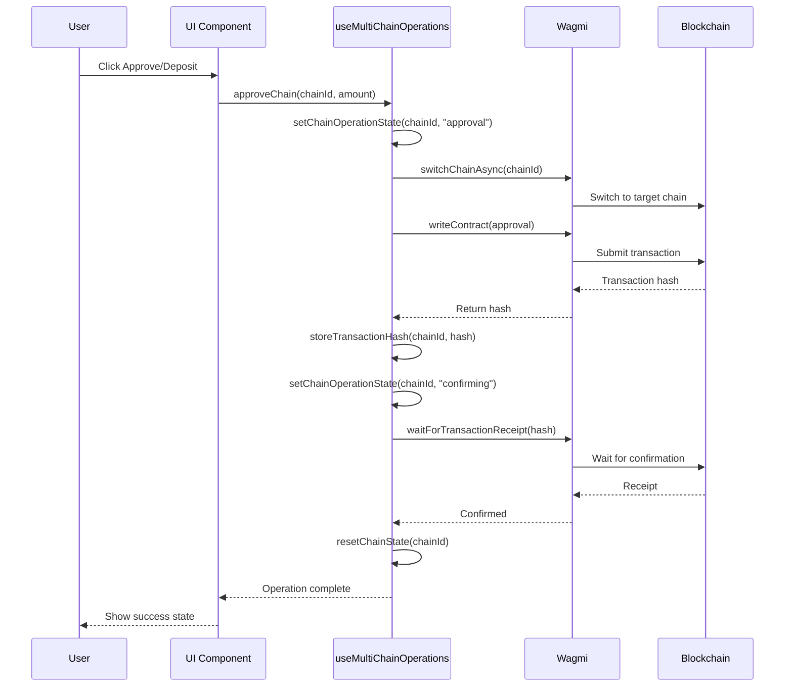
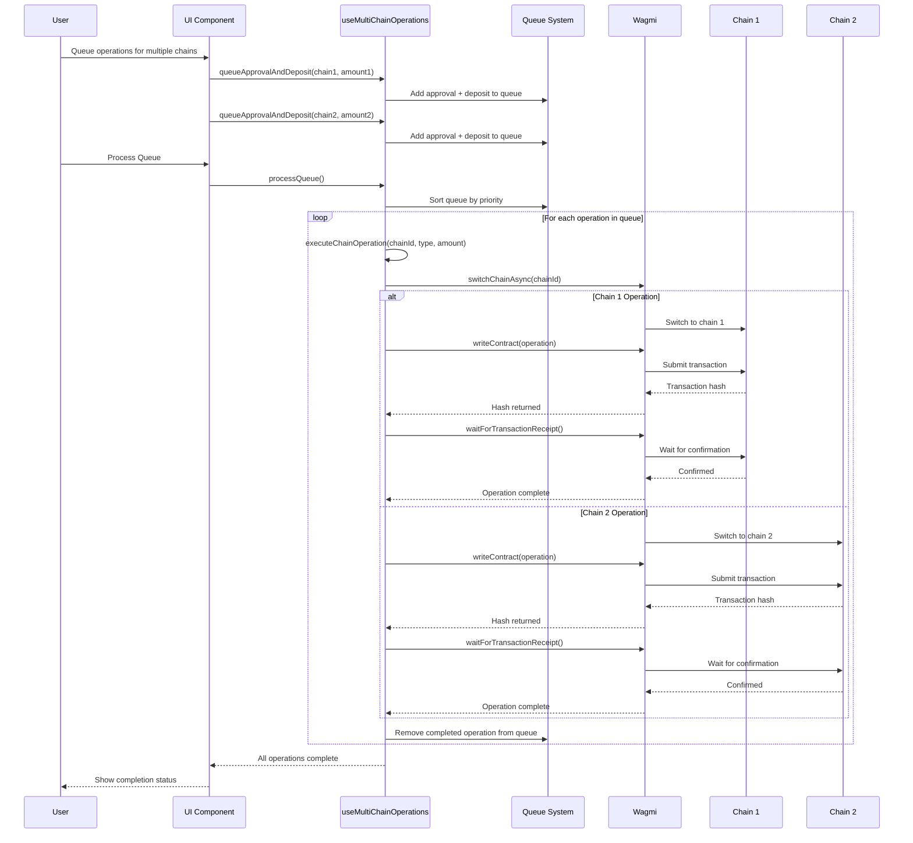

# Multi-Chain Operations Implementation Sequence

This document explains the step-by-step implementation of multi-chain operations and the sequence of events when handling multiple blockchain operations.

## Implementation Overview

The multi-chain operations system was built to extend the existing single-chain operations while maintaining backward compatibility and coordination with batch operations.

## Implementation Sequence

### Phase 1: Analysis and Design

1. **Analyzed Current Limitations**

   - Single chain operations worked well for one chain at a time
   - State conflicts when switching between chains
   - No queue system for multiple operations
   - Limited UI feedback for concurrent operations

2. **Designed Enhanced Architecture**
   ```typescript
   // Enhanced state structure
   interface MultiChainOperationState {
     chainOperations: Record<SupportedChainId, ChainOperationState>;
     operationQueue: ChainOperation[];
     isProcessingQueue: boolean;
     chainTransactions: Record<SupportedChainId, ChainTransactions>;
   }
   ```

### Phase 2: Core Hook Implementation

3. **Created `useMultiChainOperations` Hook** (`web/src/hooks/useMultiChainOperations.ts`)
   - **Per-chain state management**: Each chain maintains independent operation state
   - **Operation queue system**: Queue operations for sequential execution
   - **Backward compatibility**: Existing single-chain APIs remain unchanged
   - **Enhanced error handling**: Chain-specific error management

### Phase 3: UI Component Updates

4. **Updated `ChainApprovalCard`** (`web/src/components/ui/deposit-summary/ChainApprovalCard.tsx`)

   - Changed from global operation state to per-chain state
   - Enhanced to show individual chain loading states
   - Improved error display per chain

5. **Updated `DepositSummary`** (`web/src/components/ui/DepositSummary.tsx`)

   - Updated interface to use chain-specific state functions
   - Enhanced prop passing for multi-chain coordination

6. **Updated `ApprovalSection`** (`web/src/components/ui/deposit-summary/ApprovalSection.tsx`)

   - Modified to handle per-chain states
   - Enhanced coordination between manual and batch modes

7. **Updated `DepositInputV2`** (`web/src/components/ui/DepositInputV2.tsx`)
   - Integrated new multi-chain operations hook
   - Enhanced execute button to consider multi-chain states
   - Improved loading state management

## Operation Sequence Flow

### Single Chain Operation Sequence



### Multi-Chain Queue Operation Sequence



## State Management Sequence

### Chain State Lifecycle

1. **Initial State**: `{ isOperating: false, operationType: null, error: null }`
2. **Operation Start**: `setChainOperationState(chainId, "approval")`
3. **Transaction Submitted**: `setState({ txHash, operationType: "confirming" })`
4. **Success**: `resetChainState(chainId)`
5. **Error**: `setChainError(chainId, errorMessage)`

### Queue Management Sequence

1. **Queue Operation**: Add to `operationQueue` with priority
2. **Process Queue**: Sort by priority, execute sequentially
3. **Operation Execution**: Standard chain operation flow
4. **Queue Cleanup**: Remove completed operations
5. **Queue Completion**: Reset processing state

## Key Implementation Details

### 1. Backward Compatibility

The new system maintains full backward compatibility:

```typescript
// Old API still works
const { approveChain, depositChain, retryOperation } =
  useMultiChainOperations();

// New multi-chain features
const { queueApproval, processQueue, getChainState } =
  useMultiChainOperations();
```

### 2. State Isolation

Each chain maintains independent state:

```typescript
interface ChainOperationState {
  isOperating: boolean;
  operationType: "approval" | "deposit" | "confirming" | null;
  error?: string | null;
  isUserCancellation?: boolean;
}

// State stored per chain
chainOperations: Record<SupportedChainId, ChainOperationState>;
```

### 3. Operation Priority System

Queue operations have priorities to ensure correct execution order:

```typescript
// Approvals have priority 1 (executed first)
{ chainId, type: "approval", amount, priority: 1, id }

// Deposits have priority 2 (executed after approvals)
{ chainId, type: "deposit", amount, priority: 2, id }
```

### 4. Error Handling Enhancement

Each chain can have independent errors:

```typescript
// Get chain-specific error
const chainState = getChainState(chainId);
if (chainState.error) {
  // Handle error for this specific chain
  clearError(chainId);
}
```

### 5. Transaction History Tracking

Transaction hashes are stored per chain:

```typescript
chainTransactions: Record<
  SupportedChainId,
  {
    approvalTxHash?: Hash;
    depositTxHash?: Hash;
  }
>;
```

## Integration Points

### 1. UI Component Integration

- **ChainApprovalCard**: Shows per-chain states and operations
- **DepositSummary**: Coordinates between manual and batch modes
- **ApprovalSection**: Manages execution mode selection
- **DepositInputV2**: Integrates multi-chain operations

### 2. Existing System Coordination

- **Batch Operations**: Continues to work for parallel execution
- **Gas Estimation**: Works with both individual and batch modes
- **Allowance Checking**: Updates after individual operations
- **Query Invalidation**: Refreshes balances after operations

### 3. Chain Switching Management

The system efficiently manages chain switching:

```typescript
const ensureChainSwitch = async (targetChainId: SupportedChainId) => {
  if (currentChainId !== targetChainId) {
    await switchChainAsync({ chainId: targetChainId });
    await new Promise((resolve) => setTimeout(resolve, 500));
  }
};
```

## Usage Patterns

### Pattern 1: Immediate Single Operation

```typescript
await approveChain(SupportedChainId.ETH_SEPOLIA, "100");
```

### Pattern 2: Planned Multi-Chain Operations

```typescript
queueApprovalAndDeposit(SupportedChainId.ETH_SEPOLIA, "100");
queueApprovalAndDeposit(SupportedChainId.SEI_TESTNET, "50");
await processQueue();
```

### Pattern 3: Mixed Operations

```typescript
// Immediate operation
await approveChain(SupportedChainId.ETH_SEPOLIA, "100");

// Queue follow-up
queueDeposit(SupportedChainId.ETH_SEPOLIA, "100");
await processQueue();
```

## Benefits Achieved

1. **Scalability**: Handle multiple chains efficiently
2. **User Experience**: Clear feedback per chain
3. **Flexibility**: Choose operation mode based on needs
4. **Robustness**: Proper error handling per chain
5. **Maintainability**: Clean separation of concerns
6. **Compatibility**: No breaking changes to existing code

This implementation provides a comprehensive solution for multi-chain operations while maintaining the simplicity and robustness of the existing single-chain system.
