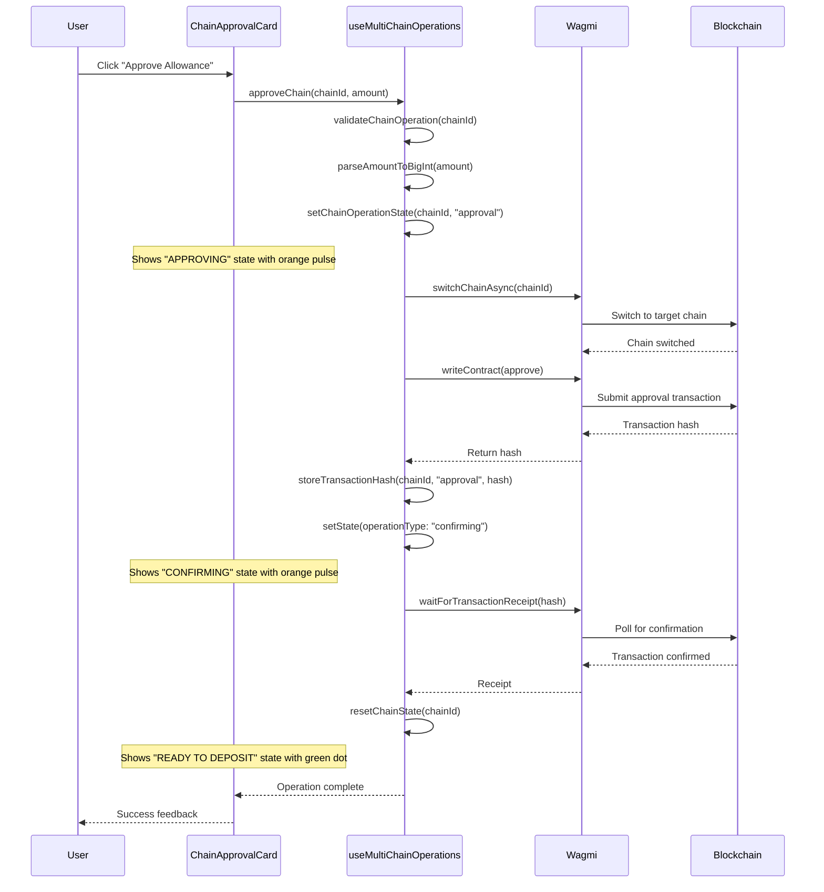
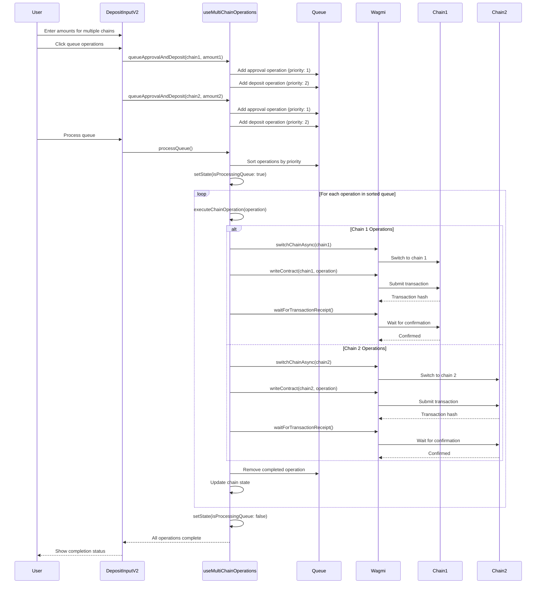
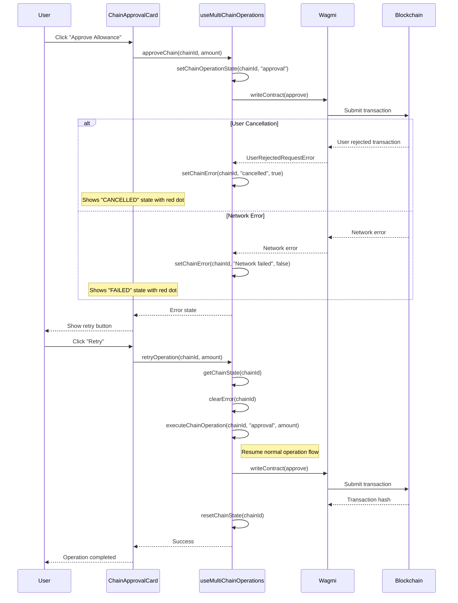
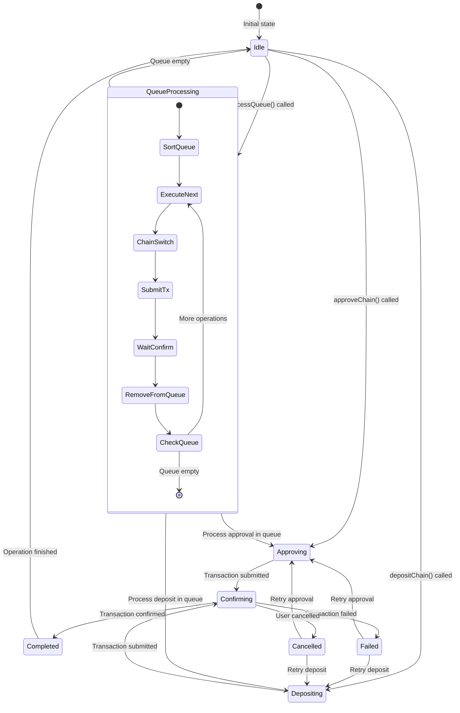
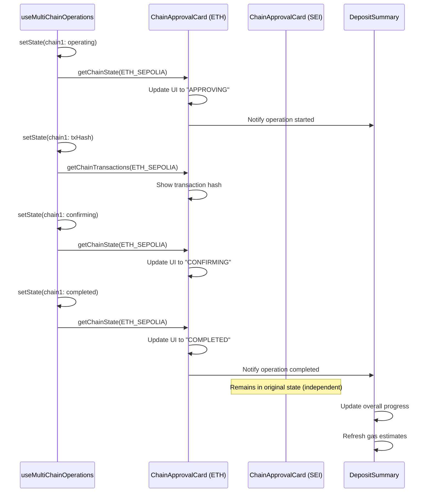
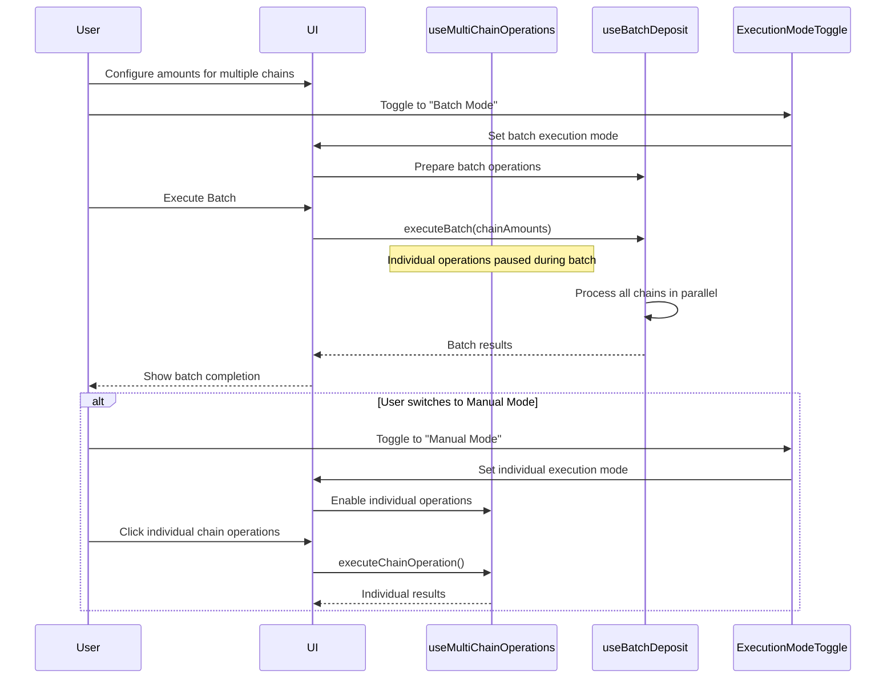

# Technical Sequence Diagrams

This document provides detailed technical sequence diagrams for different multi-chain operation scenarios.

## 1. Single Chain Operation Flow

## 2. Multi-Chain Queue Operation Flow

## 3. Error Handling and Retry Flow

## 4. State Management Flow

## 5. UI State Synchronization Flow

## 6. Integration with Batch Operations

## Implementation Notes

### Key Design Decisions

1. **Per-Chain State Isolation**: Each chain maintains independent operation state
2. **Priority-Based Queue**: Operations execute in priority order (approvals before deposits)
3. **Backward Compatibility**: Existing APIs continue to work unchanged
4. **Error Isolation**: Errors on one chain don't affect others
5. **Chain Switch Optimization**: Efficient chain switching between operations

### State Management Strategy

- **Local State**: Per-chain operation states
- **Queue State**: Operation queue with priorities
- **Global State**: Processing flags and coordination
- **Transaction History**: Persistent hash storage per chain

### Error Handling Strategy

- **User Cancellation**: Distinguishable from system errors
- **Per-Chain Errors**: Independent error states
- **Retry Logic**: Smart retry based on operation type
- **Queue Resilience**: Failed operations don't stop queue processing

This technical implementation provides robust multi-chain operation handling while maintaining simplicity and backward compatibility.
