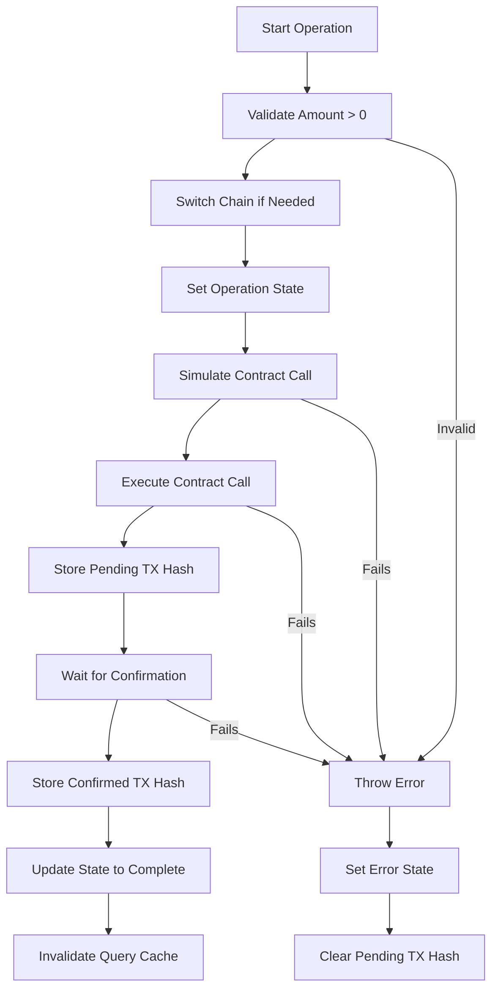
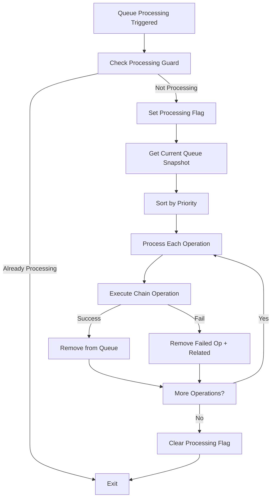
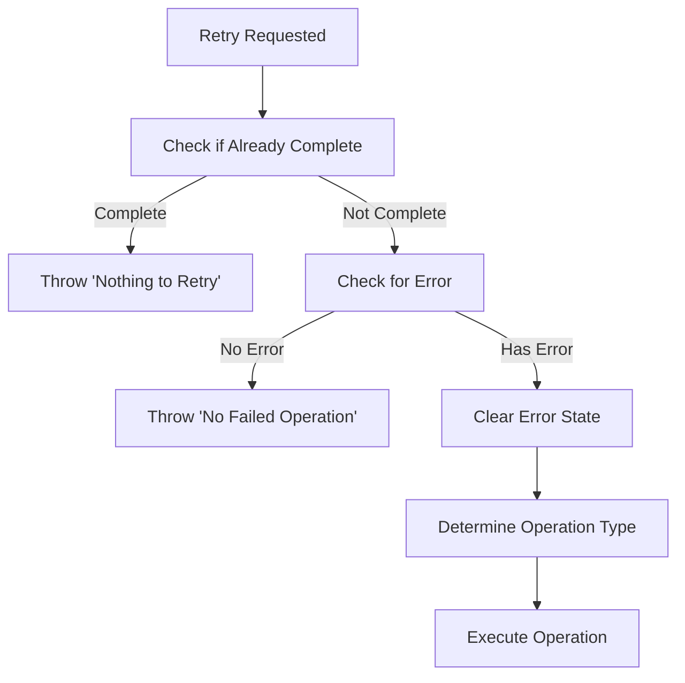

# useMultiChainOperations Hook Architecture

## Overview

The `useMultiChainOperations` hook is a complex state management system for handling multi-chain cryptocurrency operations (approvals and deposits) across different blockchain networks. It manages both individual operations and batch queue processing with advanced features like cancellation, retry logic, and race condition prevention.

## Core Concepts

### 1. **Chain Operations**

- **Approval**: Allowing a vault contract to spend tokens on behalf of the user
- **Deposit**: Actually transferring tokens to the vault contract
- **Flow**: Approval must happen before deposit for each chain

### 2. **Operation Modes**

- **Queue-Based Operations**: All operations go through the queue system
- **Auto-Processing**: Automatic queue execution when items are added
- **Single = Queue of 1**: Single operations are just queues with one item

### 3. **State Management**

The hook manages complex state across multiple dimensions:

- Per-chain operation states (operating, error, completion)
- Transaction hashes (pending and confirmed)
- Queue state (operations waiting to be processed)
- Global processing state

## Data Structures

### Core Interfaces

```typescript
interface ChainOperationState {
  isOperating: boolean; // Currently executing an operation
  operationType: OperationType | null; // "approval" | "deposit" | "confirming"
  txHash: Hash | null; // Current transaction hash
  error: string | null; // Error message if operation failed
  isUserCancellation: boolean; // Was error due to user cancellation
  lastCompleted?: "approval" | "deposit" | null; // Last successful operation
  lastErrorAt?: number; // Timestamp of last error
}

interface ChainTransactions {
  approvalTxHash?: Hash; // Pending approval transaction
  depositTxHash?: Hash; // Pending deposit transaction
  approvalConfirmedTxHash?: Hash; // Confirmed approval transaction
  depositConfirmedTxHash?: Hash; // Confirmed deposit transaction
}

interface ChainOperation {
  chainId: SupportedChainId; // Which chain to operate on
  type: "approval" | "deposit"; // Type of operation
  amount: string; // Amount to process
  priority: number; // Queue priority (lower = higher priority)
  id: string; // Unique identifier
}
```

### Global State

```typescript
interface MultiChainOperationState {
  chainOperations: Record<SupportedChainId, ChainOperationState>;
  operationQueue: ChainOperation[];
  isProcessingQueue: boolean;
  chainTransactions: Record<SupportedChainId, ChainTransactions>;
  inFlightChainId: SupportedChainId | null;
}
```

## Architecture Components

### 1. **State Management Layer**

- **Safe State Updates**: Protected against updates after component unmount
- **Atomic Operations**: State changes happen atomically to prevent races
- **Cleanup**: Proper resource cleanup on unmount

### 2. **Operation Execution Layer**

- **Chain Switching**: Automatic wallet chain switching
- **Validation**: Amount and chain validation before operations
- **Simulation**: Pre-flight contract simulation to catch errors early
- **Transaction Monitoring**: Waiting for transaction confirmation
- **Cancellation**: Support for aborting long-running operations

### 3. **Queue Management Layer**

- **Priority Processing**: Operations processed by priority
- **Deduplication**: Prevents duplicate operations in queue
- **Auto-Processing**: Automatic queue execution with debouncing
- **Error Handling**: Failed operations are removed, related operations skipped

### 4. **Concurrency Control**

- **Race Prevention**: Multiple guards against concurrent execution
- **Abort Controllers**: Cancellation tokens for async operations
- **Processing Flags**: Atomic flags to prevent double-processing

## Operation Flows

### Individual Operation Flow



### Queue Processing Flow



### Retry Logic Flow



## Key Features

### 1. **Smart Retry Logic**

- Won't retry if work is already done (deposit confirmed)
- Determines correct operation type based on transaction state
- Only retries actual failures, not successful operations

### 2. **Redundancy Prevention**

- Skips approval if already confirmed when queueing approval+deposit
- Deduplicates identical operations in queue
- Validates amounts before expensive operations

### 3. **Robust Cancellation**

- Abort controllers for long-running operations
- Cancellation checks at strategic points
- Proper cleanup of pending state on cancellation

### 4. **Race Condition Prevention**

- Processing guards prevent concurrent queue execution
- Atomic state updates prevent state corruption
- Debounced auto-processing prevents rapid firing

### 5. **Error Recovery**

- Comprehensive error categorization
- Smart error state management
- Cleanup of inconsistent state on failures

## API Surface

### Simplified Queue-Based Operations (Handles Single + Batch)

```typescript
// Single operations (auto-processed immediately)
queueApproval(chainId, amount): void
queueDeposit(chainId, amount): void
queueApprovalAndDeposit(chainId, amount): void

// Batch operations
queueBatchOperations(chainAmounts[]): void

// Legacy individual operations (can be removed)
approveChain(chainId, amount): Promise<Hash>  // → use queueApproval
depositChain(chainId, amount): Promise<Hash>   // → use queueDeposit
retryOperation(chainId, amount): Promise<Hash> // → keep for error recovery
```

### State Access

```typescript
getChainState(chainId): ChainOperationState
getChainTransactions(chainId): ChainTransactions
isChainOperating(chainId): boolean
isAnyChainOperating: boolean
isProcessingQueue: boolean
queueLength: number
```

### Control Operations

```typescript
clearQueue(): void
cancelQueue(): void
clearError(chainId): void
clearAllErrors(): void
```

## Complexity Sources

### 1. **Multi-Dimensional State**

- Per-chain operation states
- Transaction tracking (pending + confirmed)
- Global queue state
- Processing coordination

### 2. **Async Coordination**

- Chain switching
- Transaction waiting
- Queue processing
- Cancellation handling

### 3. **Error Handling**

- User rejections vs technical errors
- Partial failure recovery
- State cleanup on errors

### 4. **Race Condition Prevention**

- Multiple async operations
- State update timing
- Queue processing coordination

## Simplification Opportunities

### 🎯 **Major Insight: Queue-Only API**

**Current Problem**: Duplicate APIs for individual vs queue operations

- `approveChain()` + `queueApproval()` do the same thing
- `depositChain()` + `queueDeposit()` do the same thing
- Complex branching logic

**Solution**: Use queue system for everything

- Single operation = queue with 1 item
- Auto-processing means immediate execution for single items
- **~200 lines of code eliminated** by removing individual operation methods
- **50% simpler API** surface

### Before/After API Comparison

```typescript
// BEFORE: Dual APIs (831 lines)
const { approveChain, queueApproval } = useMultiChainOperations();
await approveChain(chainId, amount); // Individual
queueApproval(chainId, amount); // Queue

// AFTER: Queue-only API (~600 lines)
const { queueApproval } = useMultiChainOperations();
queueApproval(chainId, amount); // Works for single OR batch
```

## Decoupling Opportunities

### 1. **Eliminate Individual Operations** (Priority 1)

- Remove `approveChain`, `depositChain` methods
- Keep only queue-based operations
- **Immediate 25% code reduction**

### 2. **Extract Queue Manager**

- Move queue logic to separate `useOperationQueue` hook
- Simplify main hook to focus on execution

### 3. **Extract Transaction Manager**

- Move transaction tracking to separate service
- Cleaner separation of concerns

### 4. **Extract Chain Operation Logic**

- Move individual operation logic to separate functions
- Easier testing and maintenance

### 5. **Extract State Management**

- Use `useReducer` for complex state updates
- More predictable state transitions

This architecture has grown organically but would benefit from decomposition into smaller, focused components while maintaining the same functionality and API.
